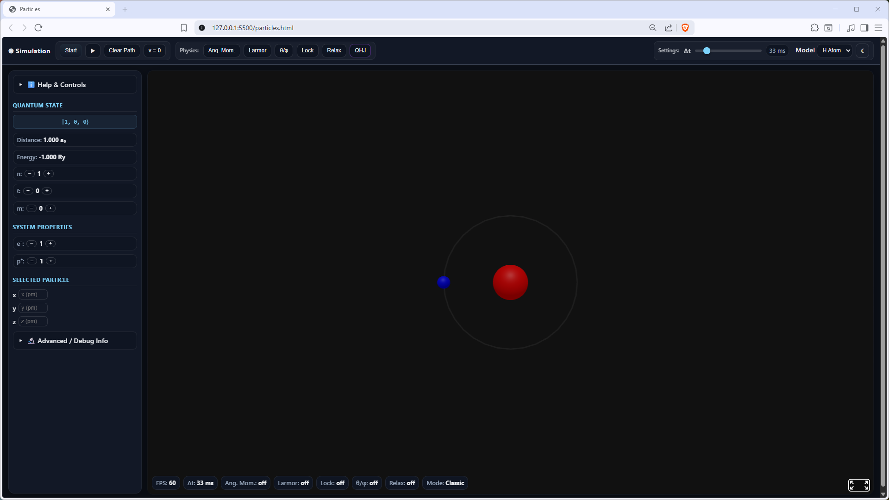

## 🔗 [Live Demo](https://trustpaddy.github.io/quantum-trajectories/particles.html)

# Quantum Trajectories - QHJ Simulation

**An interactive 3D simulator for hydrogen-like atoms — visualizing quantum trajectories using Yang's Quantum Hamilton-Jacobi theory.**

<!-- Replace with an actual screenshot of your simulation -->


*Screenshot: Hydrogen atom in ground-state equilibrium.*

---

## What Is This?

This is a browser-based 3D particle simulator that lets you watch electrons orbit atomic nuclei in real time. Unlike typical orbital visualizations that show static probability clouds, this simulator computes **actual electron trajectories** based on forces derived from quantum mechanics.

It supports two physics engines:
- **Classic Mode** — individual quantum correction terms (Coulomb, centrifugal, radial wavefunction corrections)
- **QHJ Mode** — a unified quantum potential from Yang's Quantum Hamilton-Jacobi formulation that naturally reproduces orbital shapes and shell structure

No installation required. Just open `particles.html` in your browser.

---

## The Physics Behind It

### The Problem: What Does the Electron Actually Do?

Ask a physicist what the electron does inside a hydrogen atom, and the standard answer is unsatisfying: *"It doesn't have a trajectory. It exists everywhere at once, with different probabilities. Don't ask what it does between measurements."*

This is experimentally correct, but it leaves a fundamental question unanswered: **Why doesn't the electron fall into the nucleus?** In classical physics, a negative charge attracted by a positive one should spiral inward — especially in the ground state, where there is no orbital angular momentum (l = 0, so no "orbiting"). Standard quantum mechanics essentially says: *"The Heisenberg uncertainty principle prevents it"* — which is true, but describes *what* happens rather than *how*. There is no mechanism.

### Yang's Answer: A Quantum Force

In 2005, C.D. Yang showed that by reformulating the Schrodinger equation using the Quantum Hamilton-Jacobi (QHJ) method, you can derive **concrete forces** acting on the electron. The key result is a total potential that combines the classical Coulomb attraction with quantum correction terms:

> When the electron gets too close to the nucleus, a repulsive **quantum force** becomes stronger than the Coulomb attraction — pushing the electron back outward. When it drifts too far away, the Coulomb force dominates and pulls it back in. At exactly the Bohr radius, both forces cancel — a stable equilibrium.

This is like a ball sitting in a bowl: no matter where you place it, it always rolls back to the lowest point. Yang shows that the atom works exactly like this — the "bowl" is shaped by the combination of the Coulomb potential and the quantum potential.

### Shell Structure From Forces

For excited states (n > 1), the quantum potential creates **infinite barriers** at the nodes of the wavefunction. These barriers divide space into concentric shells. The electron is literally trapped inside its shell — not because crossing is "improbable", but because an infinite force prevents it. This turns a statistical statement into a mechanical one.

For states with angular momentum (l > 0), additional angular barriers confine the electron to specific cone angles, naturally producing the familiar orbital shapes (s, p, d, f) — not as probability distributions, but as regions where the forces allow the electron to move.

### An Analogy

Imagine watching a ball rolling on an invisible surface. Standard quantum mechanics gives you a map showing *how likely* it is to find the ball at different locations. Yang gives you the *shape of the surface itself*: here's a valley (that's where the ball usually sits), and here's a ridge (the ball can't cross it). Both descriptions are correct, but Yang's version explains *why* the probability map looks the way it does.

### Honest Limitations

Yang's formulation makes **exactly the same predictions** as standard quantum mechanics. It is a reformulation, not a new theory — mathematically equivalent to the Schrodinger equation. The differences are interpretive, not empirical. The formalism is developed for single-electron systems in the non-relativistic regime. Multi-electron correlations, spin-orbit coupling, and quantum field effects (Lamb shift, etc.) are outside its scope.

---

## Why QHJ?

Compared to assembling individual correction terms (Coulomb + centrifugal + radial correction + angular correction + ...), the QHJ approach offers several advantages:

| | Classic Mode | QHJ Mode |
|---|---|---|
| **Force calculation** | Sum of individual terms, each added manually | Single unified potential, all effects included |
| **Shell barriers** | Approximated via radial wavefunction correction | Emerge naturally from the quantum potential |
| **Orbital shapes** | Require separate angular correction toggle | Built into the potential — s, p, d shapes appear automatically |
| **Atomic stability** | Needs Kratzer term + centrifugal balance | Stability follows directly from force equilibrium |
| **Classical limit** | Hard to see how quantum effects vanish for large n | Transparent: quantum forces shrink relative to Coulomb as n grows |

---

## Features

- **5 atomic systems**: Hydrogen (H), Diatomic hydrogen cation (H2+), Hydrogen anion (H-), Helium cation (He+), Helium (He)
- **Quantum numbers** n, l, m with enforced selection rules (delta-l = +/-1, delta-m <= +/-1)
- **Two physics modes**: Classic (individual force terms) and QHJ (unified quantum potential)
- **Drag & drop** particles in the 3D scene
- **Trajectory recording** to visualize electron paths over time
- **Real-time readouts**: distance, energy, force vectors, velocity, FPS
- **Automatic relaxation**: watch electrons cascade down energy levels
- **Dark / Light theme** with persistent preference
- **Fully interactive** quantum state transitions with toast notifications for invalid states
- **Zero dependencies**: runs entirely in the browser, no server or build step needed

---

## Getting Started

```bash
# Option 1: Just open the file
# Navigate to the project folder and open particles.html in your browser

# Option 2: Use a local server (avoids potential CORS issues)
python -m http.server 8000
# Then open http://localhost:8000/particles.html
```

That's it. No `npm install`, no build step, no configuration.

---

## Usage Guide

### Basic Controls

| Control | Action |
|---------|--------|
| **Start / Stop** | Toggle the simulation |
| **Record (play icon)** | Start/stop recording the electron trajectory |
| **Clear Path** | Delete all recorded trajectory points |
| **v = 0** | Reset all particle velocities |
| **Lock** | Freeze the nucleus in place |

### Quantum State

Use the **n+/n-**, **l+/l-**, and **m+/m-** buttons to change quantum numbers. The simulator enforces selection rules — invalid transitions show a warning toast.

- **n** (principal): determines the energy level and overall orbital size
- **l** (angular momentum): determines the orbital shape (0=s, 1=p, 2=d, ...)
- **m** (magnetic): determines the orientation and azimuthal velocity

### Physics Modes

| Button | Effect |
|--------|--------|
| **Ang. Mom.** | Toggle the centrifugal force term (classic mode) |
| **Larmor** | Enable radiation damping (exponential velocity decay) |
| **theta/phi** | Add angular wavefunction corrections (classic mode) |
| **Relax** | Automatic spontaneous emission — electron decays to lower levels |
| **QHJ** | Switch to Yang's unified quantum potential (recommended for exploring orbital physics) |

### QHJ Mode

Click the **QHJ** button (turns purple when active). In this mode:
- The electron is placed at the equilibrium position for the current quantum state
- All quantum corrections are handled by a single potential — no need to toggle individual terms
- For m != 0: the electron orbits at a specific cone angle with azimuthal velocity
- For m = 0, l > 0: the electron oscillates radially around equilibrium
- Shell barriers prevent the electron from crossing wavefunction nodes

### Interacting with Particles

- **Click** a particle to select it (position shown in the side panel)
- **Click + drag** to move a particle in 3D
- **Type coordinates** in the input fields (in picometers) and press Enter to set exact positions
- **Add/remove** electrons and protons with the +/- buttons

---

## Project Structure

```
Particle-Simulation-Physics/
  particles.html    Main entry point — 3D scene, UI, event wiring
  dynamics.js       Physics engine — forces, integration, state management
  yang-qhj.js       QHJ module — Yang's quantum potential, equilibrium solver
  fps.js            Frame rate monitoring component
  style.css         Additional styling
  aframe-v1.5.0.min.js   A-Frame 3D framework (vendored)
```

### Architecture

All physics runs in **atomic units** (hbar = m_e = e = 4*pi*epsilon_0 = 1):
- Length: 1 a.u. = Bohr radius = 0.529 Angstrom
- Energy: 1 a.u. = 1 Hartree = 27.2 eV
- Time: 1 a.u. = 2.42 * 10^-17 s

The main loop uses `requestAnimationFrame` with physics sub-stepping. Each frame:
1. Gather forces for all particles (mode-dependent)
2. Integrate velocities and positions (Euler method)
3. Sync 3D scene entities
4. Update UI readouts

---

## Tech Stack

| Technology | Purpose |
|------------|---------|
| **A-Frame 1.5.0** | WebGL-based 3D scene rendering |
| **Three.js** | 3D graphics (bundled with A-Frame) |
| **Vanilla JavaScript (ES6+)** | All physics, UI logic, state management |
| **HTML5 / CSS3** | Layout, theming, responsive design |

No frameworks. No build tools. No package manager. Pure browser-side code.

---

## References

- Yang, C.D. (2006). *Solving quantum trajectories in Coulomb potential by quantum Hamilton-Jacobi theory.* International Journal of Quantum Chemistry, 106, 1620-1639. [DOI: 10.1002/qua.20878](https://doi.org/10.1002/qua.20878)
- Yang, C.D. (2005). *Quantum dynamics of hydrogen atom in complex space.* Annals of Physics, 319, 399-443.
- Leacock, R.A. & Padgett, M.J. (1983). *Hamilton-Jacobi theory and the quantum action variable.* Physical Review Letters, 50, 3-6.
- Bohm, D. (1952). *A suggested interpretation of the quantum theory in terms of "hidden" variables.* Physical Review, 85, 166-193.

---

## License

This project is part of academic work at Frankfurt University of Applied Sciences. License terms to be determined.
